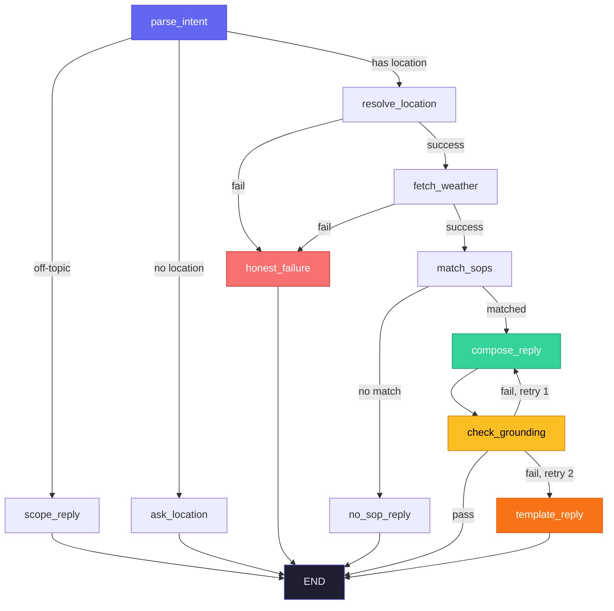

# Graph Documentation

## Mermaid Diagram

## Node Descriptions

| Node | Type | Description |
|------|------|-------------|
| parse_intent | LLM | Extracts structured intent (location, activity, groups, time) from user message |
| scope_reply | Fixed text | Replies when question is off-topic (no LLM) |
| ask_location | Fixed text | Asks user for location when none is provided |
| resolve_location | Code | Geocodes the location name via Open-Meteo API |
| fetch_weather | Code | Fetches 3-day forecast from Open-Meteo API |
| match_sops | Code | Computes metrics, evaluates all SOPs, resolves conflicts |
| no_sop_reply | Fixed text | Replies when no SOP matches the conditions |
| compose_reply | LLM | Phrases the advisory in natural language using pre-filled guidance |
| check_grounding | Code | Verifies all numbers in the reply exist in the weather data |
| template_reply | Fixed text | Fallback when grounding fails twice (no LLM) |
| honest_failure | Fixed text | Reports geocoding or weather API failures honestly |
